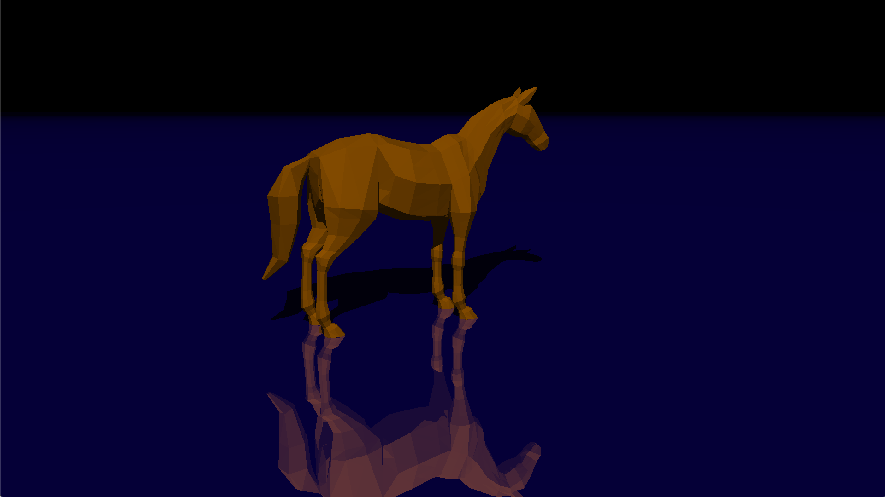
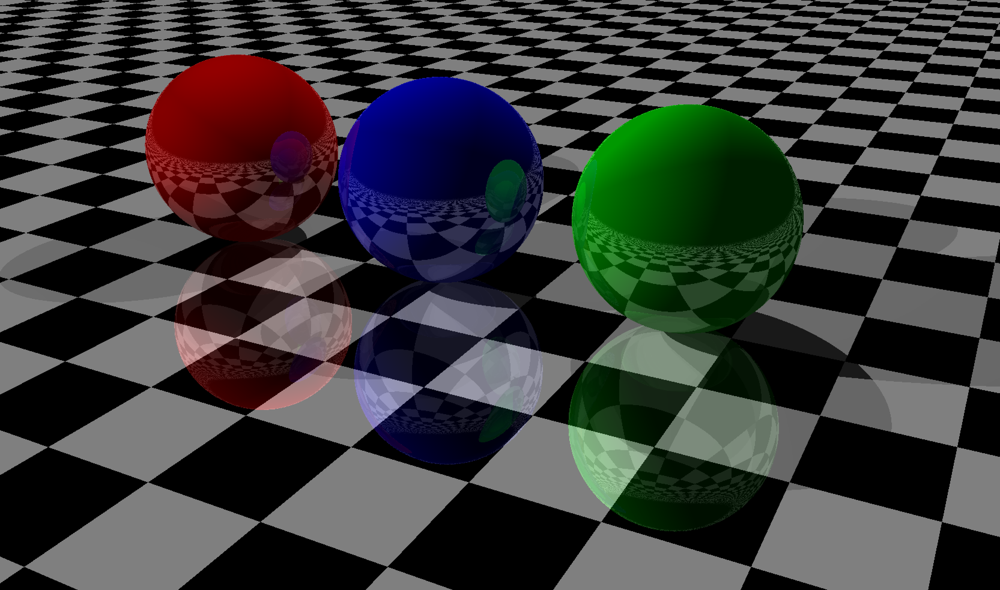

# 🌟 miniRT

> 📚 **PROYECTO EDUCATIVO** - Ray Tracer básico desarrollado como parte del currículum de 42 School

Un ray tracer minimalista implementado en C que renderiza escenas 3D básicas usando algoritmos clásicos de ray tracing. Este proyecto es parte del plan de estudios de 42 School y está diseñado para enseñar los fundamentos de la computación gráfica 3D.


## 🖼️ Ejemplos de Renderizado

### Modelo 3D Complejo (Horse)
<div align="center">
  
  <p><i>Modelo de caballo renderizado usando triangulación de archivo OBJ</i></p>
</div>

### Efectos de Reflexión
<div align="center">
  
  <p><i>Escena demostrando reflexiones especulares en superficies</i></p>
</div>

## ✨ Funcionalidades Implementadas

### 🎯 Primitivas Geométricas
- **Esferas** - Renderizado con iluminación básica
- **Planos** - Infinitos con orientación configurable
- **Cilindros** - Con tapas superior e inferior
- **Triángulos** - Para modelos más complejos

### 💡 Sistema de Iluminación
- **Luz ambiente** - Iluminación global básica
- **Luces puntuales** - Con intensidad y color configurables
- **Sombras** - Proyección básica de sombras
- **Reflexiones** - Espejos simples (funcionalidad básica)

### 🎨 Características de Renderizado
- **Ray tracing clásico** - Algoritmo básico de trazado de rayos
- **Intersecciones geométricas** - Cálculo matemático preciso
- **Sombreado Phong** - Modelo de iluminación básico
- **Multi-threading** - Renderizado paralelo con pthread
- **Formato de salida** - Ventana MLX (MiniLibX)

### 🔧 Características Técnicas
- **Parser de escenas** - Formato `.rt` personalizado
- **Conversor OBJ a RT** - Herramienta para importar modelos 3D simples
- **Gestión de memoria** - Implementación cuidadosa sin memory leaks
- **Arquitectura modular** - Código organizado en módulos funcionales

## ⚠️ Limitaciones del Proyecto

Este es un proyecto **educativo y básico** con las siguientes limitaciones:

- **Sin aceleración GPU** - Rendering completamente en CPU
- **Sin optimizaciones avanzadas** - No hay BVH, octrees, u otras estructuras de aceleración  
- **Calidad básica** - Sin antialiasing, sin mapas de normales avanzados
- **Formatos limitados** - Solo formato `.rt` personalizado para escenas
- **Sin materiales complejos** - Solo colores sólidos y reflectividad básica
- **Sin texturas** - No soporta mapas de textura
- **Sin efectos avanzados** - No hay refracciones, caustics, global illumination, etc.
- **Rendimiento limitado** - Tiempo de renderizado elevado para escenas complejas
- **Solo macOS/Linux** - Dependiente de MiniLibX

## 🚀 Instalación

### Prerrequisitos

**macOS:**
```bash
# MiniLibX ya incluida en el proyecto
# Compilador gcc/clang instalado por defecto
```

**Linux (Ubuntu/Debian):**
```bash
sudo apt-get update
sudo apt-get install gcc make
sudo apt-get install libx11-dev libxext-dev libxrandr-dev libxinerama-dev libxss-dev libxcursor-dev libxcomposite-dev libasound2-dev libpulse-dev libxi-dev libgl1-mesa-dev libglu1-mesa-dev
```

### Compilación

1. **Clonar el repositorio:**
```bash
git clone https://github.com/PILTRAFILLA317/miniRT.git
cd miniRT
```

2. **Compilar el proyecto:**
```bash
make
```

3. **Compilar herramientas adicionales:**
```bash
cd obj_to_rt
make
```

## 🎮 Uso

### Ejecutar el Ray Tracer

```bash
./miniRT scenes/[archivo_escena].rt
```

### Ejemplos de Escenas

```bash
# Escena básica con esfera y plano
./miniRT scenes/sph.rt

# Escena con múltiples objetos
./miniRT scenes/wolf.rt

# Plano con efecto espejo
./miniRT scenes/pl_mirror.rt

# Escena con patrón de tablero de ajedrez
./miniRT scenes/checkerboard.rt
```

### Controles
- **ESC** - Cerrar la aplicación
- La imagen se renderiza automáticamente al cargar

### Convertir Modelos OBJ

```bash
# Desde el directorio obj_to_rt/
./obj_to_rt modelo.obj > ../scenes/mi_escena.rt
```

## 📝 Formato de Archivo .rt

El ray tracer usa un formato de archivo personalizado `.rt`:

### Elementos Obligatorios

```bash
A [intensidad_ambiente] [R,G,B]          # Luz ambiente
C [x,y,z] [nx,ny,nz] [fov]               # Cámara  
L [x,y,z] [intensidad] [R,G,B]           # Luz puntual
```

### Objetos Opcionales

```bash
sp [x,y,z] [diámetro] [R,G,B]            # Esfera
pl [x,y,z] [nx,ny,nz] [R,G,B]            # Plano  
cy [x,y,z] [nx,ny,nz] [diámetro] [altura] [R,G,B] # Cilindro
t [x1,y1,z1]|[x2,y2,z2]|[x3,y3,z3] [R,G,B]       # Triángulo
```

### Ejemplo de Escena

```bash
A 0.2 255,255,255
C 0,0,0 0,0,-1 60
L -40,0,30 0.7 255,255,255
sp 0,0,-10 10 255,0,0
pl 0,-20,0 0,1,0 0,255,0
```

## 🏗️ Arquitectura del Código

### Estructura de Directorios
```
miniRT/
├── srcs/               # Código fuente principal
│   ├── main.c         # Punto de entrada y parsing
│   ├── ray_caster.c   # Motor de ray tracing
│   ├── *_inter.c      # Funciones de intersección
│   ├── *_linked.c     # Gestión de listas enlazadas
│   ├── color_*.c      # Cálculos de color e iluminación
│   └── vec_utils.c    # Operaciones vectoriales
├── includes/
│   └── minirt.h       # Definiciones y prototipos
├── libft/             # Biblioteca de funciones auxiliares
├── mlx/               # MiniLibX para gráficos
├── scenes/            # Archivos de escena .rt
└── obj_to_rt/         # Conversor OBJ a formato RT
```

### Módulos Principales

#### Ray Casting (`ray_caster.c`)
- Motor principal de ray tracing
- Cálculo de rayos por pixel
- Multi-threading con pthread

#### Intersecciones (`*_inter.c`)
- Cálculos matemáticos de intersección rayo-objeto
- Algoritmos específicos para cada primitiva geométrica

#### Iluminación (`light_comb.c`, `color_*.c`)
- Modelo de iluminación Phong básico
- Cálculo de sombras
- Combinación de colores

#### Utilidades Vectoriales (`vec_utils.c`)
```c
t_vec vec_add(t_vec a, t_vec b);        // Suma de vectores
t_vec vec_mult(t_vec vec, double a);    // Multiplicación escalar
double vec_dot(t_vec a, t_vec b);       // Producto punto
t_vec vec_cross(t_vec v, t_vec w);      // Producto cruz
```

## 🔧 Desarrollo y Extensión

### Añadir Nuevas Primitivas
1. Definir estructura en `minirt.h`
2. Implementar función de intersección
3. Añadir parsing en `main.c`
4. Crear función de color específica

### Mejorar el Renderizado
- Implementar antialiasing (supersampling)
- Añadir más tipos de materiales
- Optimizar con estructuras de aceleración

### Ejemplo de Extensión (Nueva Primitiva)
```c
typedef struct s_box {
    t_vec min;
    t_vec max;
    t_vec color;
} t_box;

int box_intersect(t_vec pos, t_box *box, t_vec dir);
t_vec box_intersect_point(t_vec pos, t_box *box, t_vec dir);
```

## 🐛 Problemas Conocidos

### Limitaciones de Rendimiento
- **Tiempo de renderizado lento** para escenas complejas
- **Sin aceleración** - O(n) por cada rayo para todos los objetos
- **Multi-threading básico** - Distribución simple por filas

### Problemas de Implementación
- **Precisión numérica** - Posibles artefactos con objetos muy pequeños
- **Reflexiones infinitas** - Limitadas por MAX_MIRR_RAYS
- **Parsing estricto** - Formato de archivo muy específico

### Errores Comunes
```bash
# Error de formato de archivo
Error: Invalid scene

# Archivo no encontrado  
Error: Scene does not exist

# Valores fuera de rango
Error: Invalid scene (colores deben estar entre 0-255)
```

## 🎓 Propósito Educativo

Este proyecto está diseñado para aprender:

- **Fundamentos de ray tracing** - Algoritmos básicos de rendering
- **Matemáticas 3D** - Vectores, intersecciones, transformaciones
- **Programación en C** - Gestión de memoria, punteros, estructuras
- **Paralelización** - Threading básico con pthread
- **Parsing de archivos** - Procesamiento de formatos personalizados
- **Gráficos por computadora** - Modelos de iluminación, proyección

### Conceptos Cubiertos
- ✅ Ray-object intersection algorithms
- ✅ Phong illumination model  
- ✅ Shadow casting
- ✅ Basic reflection
- ✅ Coordinate transformations
- ✅ Multi-threading basics

## 🤝 Contribución

Este es un **proyecto académico de 42 School**, pero se aceptan mejoras educativas:

### Áreas de Mejora Sugeridas
- [ ] **Documentación** - Añadir comentarios explicativos sobre los algoritmos
- [ ] **Optimización básica** - Implementar bounding boxes simples
- [ ] **Más primitivas** - Añadir conos, toros, etc.
- [ ] **Mejor parsing** - Validación más robusta de archivos .rt
- [ ] **Antialiasing** - Supersampling básico
- [ ] **Refactoring** - Mejorar organización del código

### Para Estudiantes de 42
- Código diseñado para cumplir con la Norminette
- Implementación educativa, no optimizada para producción
- Enfoque en comprensión de algoritmos

## 📄 Licencia

Este proyecto es parte del currículum académico de 42 School y está disponible para fines educativos.


---
*Proyecto educativo desarrollado como parte del currículum de 42 School*  
*Autor: PILTRAFILLA317 (umartin-) - Promoción 2023*